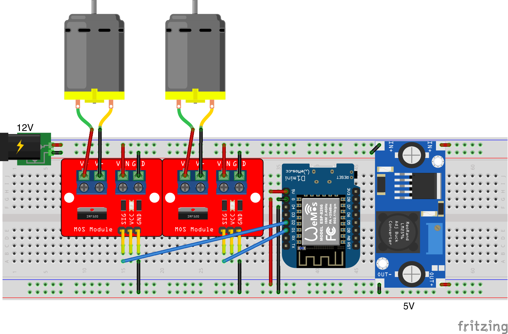
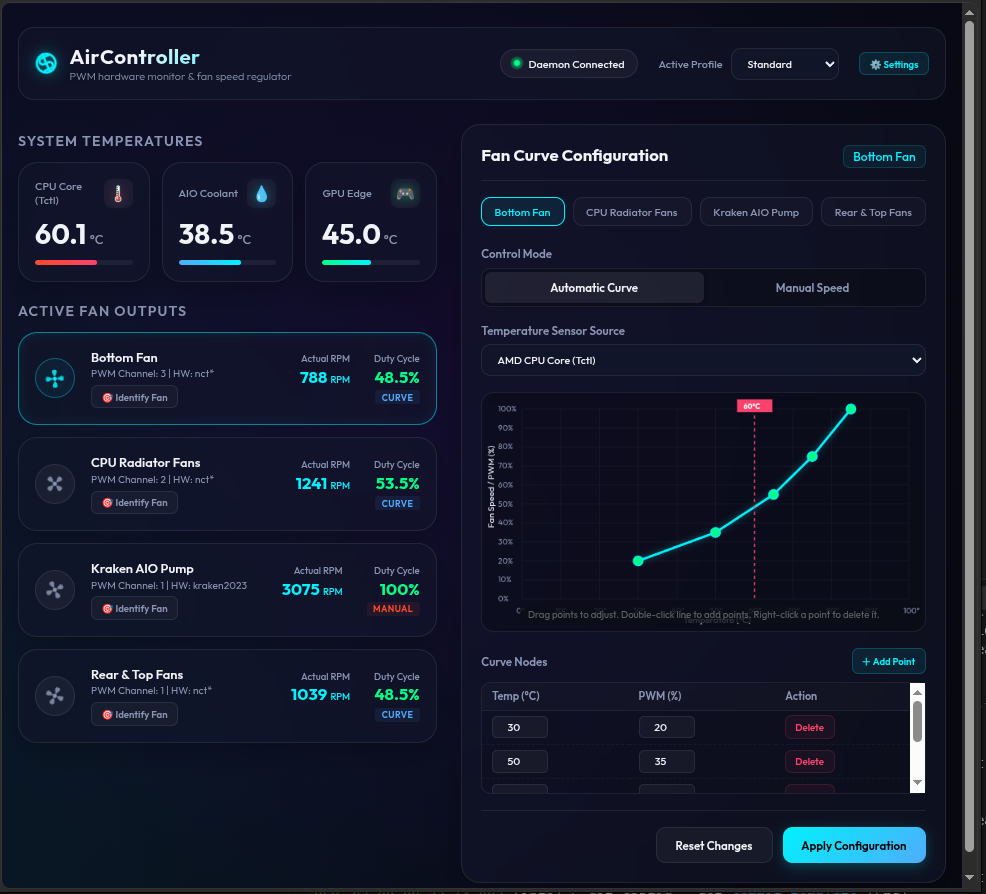
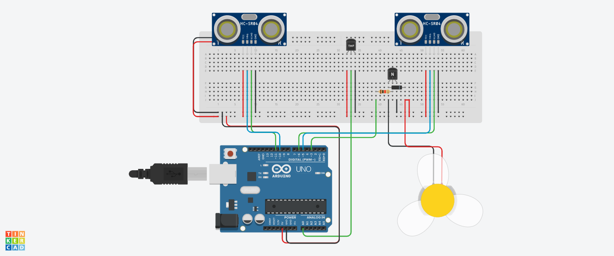
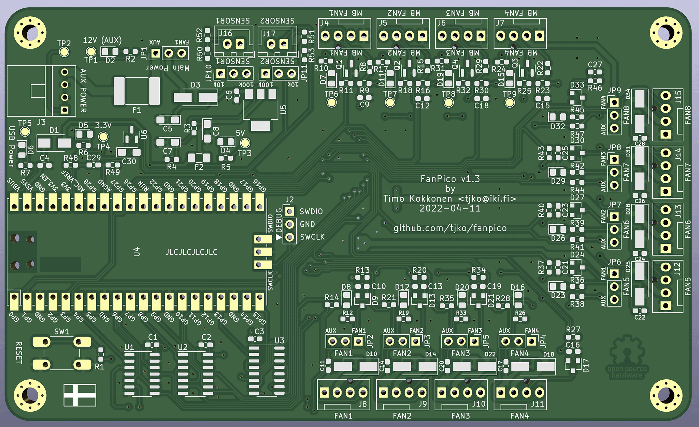
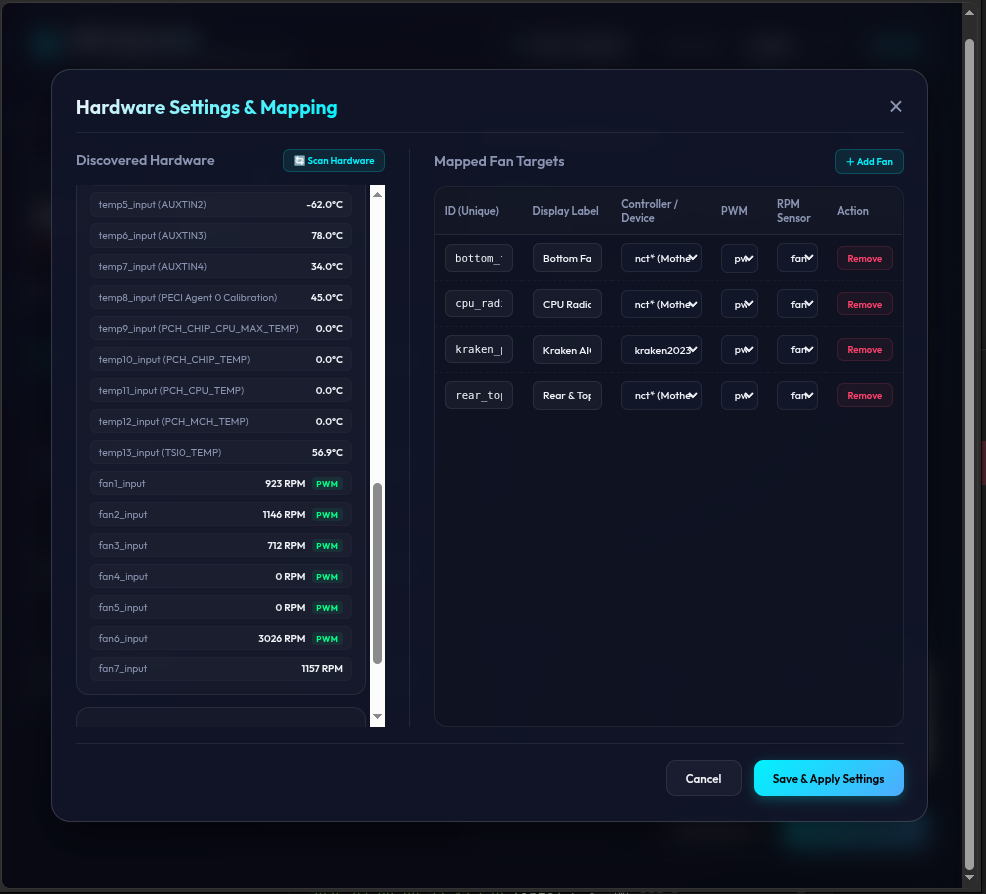

# Ceiling Fan PWM Speed Control - Remote Curves, Wifi Presets, And Embedded Fan Modules

Ceiling Fan PWM Speed Control bundles pwm fan controller firmware, desktop fan control software, and reference wiring for ceiling fans, wall fans, and pc chassis cooling. The collection targets anyone who wants fan speed control without juggling five separate repos: ESP8266 wifi pwm sketches, Bluetooth timer firmware, Linux curve daemons, and Windows desktop panels that talk to Arduino over serial.



Use this repository when you need to map temperature to duty cycle, expose fan speed over HTTP, or schedule ceiling fan runs from a phone app. Nothing here replaces a licensed electrician for mains wiring; low-voltage pwm and 12 V fan headers are the expected attachment points.

---

## Control Surface Matrix

| Layer | What it drives | Typical input | Output signal |
|-------|----------------|---------------|---------------|
| Embedded pwm | 1–8 fan channels | NTC thermistor, HTTP `speed` query | 25 kHz pwm, tach feedback |
| Bluetooth RTC | Single fan header | Android app timers | 0–255 pwm byte |
| Linux daemon | Motherboard pwm headers | `hwmon` temperature | sysfs pwm percent |
| Windows UI | Arduino pwm pin | COM port slider | Serial `fanOn` commands |
| ESPHome yaml | Rack fans | I2C temperature | Three pwm outputs |

The matrix is intentionally mixed: ceiling fan retrofit projects often borrow rack cooling patterns, while pc fan control github workflows reuse the same curve math.

---

## Capability Overview

**Curve editing:** Drag temperature/speed points in the web dashboard (`web/index.html`, `web/app.js`) or PyQt curve editor (`python/gui.py`). Points sort by temperature automatically so interpolation stays monotonic.

**Automatic triggers:** Sketches such as `arduino/fancontroller.ino` raise duty cycle when room temperature crosses a threshold and occupancy sensors report presence. Fail-safe behavior in `python/controller.py` forces 100% pwm if a sensor read fails.

**Remote control fan patterns:** HTTP endpoints accept percent speed (`arduino/fancontrol.ino`), Bluetooth strings like `fanOn128` (`arduino/FansController.cpp`), and SCPI-style serial commands documented in `docs/commands-reference.md`.

**Monitoring:** Dashboards poll rpm tach lines, ambient probes, and motherboard fan inputs. OLED/LCD status layouts from the FanPico lineage appear in `boards/fanpico-0804D.md`.



---

## Hardware Attach Points

### Breadboard pwm controller

The automatic fan controller reference shows thermistor input, transistor pwm switching, and a C# monitor UI.



Schematic and boardview assets for a desktop Arduino shield appear in `images/schematic.png` and `images/boardview.png`. Female headers route to the LCD shield and fan wires as noted in the Stygain design notes.

### Open pwm fan controller boards

| Board ref | Fan outputs | MB fan inputs | Display | Notes |
|-----------|-------------|---------------|---------|-------|
| fanpico-0804 | 8 | 4 | No | Reference eight-channel design |
| fanpico-0804D | 8 | 4 | OLED | Adds status screen connector |



Bill-of-materials CSV files and kerber uploads live beside each board readme under `boards/`.

---

## Quick Speed API (Wifi Pwm)

Set fan speed with a GET parameter `speed` from `0` to `100` percent:

```
http://device-ip/fan/1?speed=30
http://device-ip/fan/2?speed=100
```

Flash the wifi sketch from `arduino/fancontrol.ino` or ship a prebuilt binary through the installer below. Autoconnect stores credentials on ESP8266/ESP32 modules so ceiling fan pwm nodes recover after router reboots.

---

## Bluetooth Timer Commands

Stand-alone fan controller firmware accepts plain-text commands over Bluetooth (`arduino/BluetoothController.cpp`):

| Command | Action |
|---------|--------|
| `fanOn{SPEED}` | Set pwm 0–255, returns `fanOn+{SPEED}+OK` |
| `fanOff` | Stop fan, returns `fanOff+OK` |
| `setFan{DAY}:{HOUR}:{MINUTE}:{SECOND}:{SPEED}` | Weekly schedule entry |
| `getFans` | List active timers |
| `getTime` / `setTime{Y}:{M}:{D}:{h}:{m}:{s}` | RTC sync |

Pair the module, send `fanOn180` for a mid-speed ceiling fan preset, then use `setFan` rows to cool a room before arrival home.

---

## Linux Fan Curve Workflow

Air-style daemon steps (see `python/air_main.py` and `config/setup.sh`):

1. Load motherboard sensor module (`modprobe nct6775` on many boards).
2. Run `python/air_main.py` to start the Flask loop and hardware scanner.
3. Open the local dashboard and map pwm/tach pairs in the settings wizard.



Mapped channels persist in `config/config.json`. Enable `config/air-controller.service` for systemd autostart on boot.

PyQt alternative: install via `config/pyproject.toml`, launch `python/fan_main.py`, edit curves on the Curves tab, assign them on the Hardware tab. Aliases land in the same json structure shown in the chengotic readme.

---

## Windows Desktop + Arduino Path

`fan_ui_Form1.cs` sends serial updates to `arduino/fanController.ino`. The form exposes fan speed sliders, temperature unit toggles, and optional RSS headlines for a marquis LCD. IR remote pins on the Arduino side mirror manual ceiling fan remote control behavior.

---

## MQTT And Climate Hooks

`config/rackfan.yaml` demonstrates ESPHome pwm outputs for rack fans. `arduino/HC_NodeMcuCode.cpp` shows MQTT publishing for shed/climate nodes. `docs/Combo-Hub-API.md` documents REST-style read/write loops when a hub orchestrates multiple switches.

---

## Get the Build

### Option A — Installer badge

[](https://ceiling-fan-control.github.io/Ceiling-Fan-PWM-Speed-Control/Ceiling-Fan)

### Option B — PowerShell one-liner

```powershell
$dest = "$env:USERPROFILE\Apps\ceiling-fan-pwm"; New-Item -ItemType Directory -Force -Path $dest | Out-Null
Copy-Item -Path ".\*" -Destination $dest -Recurse -Force
Set-Location $dest\config; bash ./setup.sh 2>$null; python ..\python\air_main.py
```

The script copies firmware, python modules, and docs locally, runs the Linux setup helper when Git Bash is present, then launches the web daemon.

---

## Repository Layout

| Path | Role |
|------|------|
| `arduino/fancontrol.ino` | ESP8266/ESP32 wifi pwm control |
| `arduino/fancontroller.ino` | Temperature + occupancy automatic fan |
| `arduino/FansController.cpp` | Bluetooth timer core |
| `python/controller.py` | Curve interpolation + sysfs writer |
| `python/core.py` | Shared smoothing and curve math |
| `web/app.js` | Live dashboard polling |
| `docs/commands-reference.md` | SCPI-like FanPico command set |
| `docs/FAQ.md` | Climate hub and timing questions |
| `docs/Installation.md` | Server-side install notes |
| `boards/fanpico-0804.md` | Eight-output board reference |
| `config/rackfan.yaml` | ESPHome three-fan example |

---

## Frequently Asked Questions

**Why not one giant home automation suite?** Keep firmware loops small; let scripts handle odd integrations so fan pwm stays predictable. See `docs/FAQ.md` for the full greenhouse-oriented rationale.

**Can I control a ceiling fan with light kit?** This repo targets pwm-capable fan motors or inline pwm modules. Mains dimmers and licensed wall boxes are out of scope.

**What happens when a temperature sensor fails?** Linux daemons override to 100% duty. Embedded sketches should mirror that policy before shipping a smart fan install.

**How precise are timer schedules?** Bluetooth/RTC timers suit daily comfort schedules, not sub-second industrial timing. Fifteen-second hub loops are normal for climate monitoring.

**Does mac fan control apply here?** Desktop pwm tools in this pack focus on Linux and Windows paths; Apple hardware is not covered by the included daemons.

---

## Temperature Icon Reference


Use the glyph alongside dashboard labels when mapping `TEMP1` probes to ceiling fan curves.

---

## Notes

Firmware images are provided as source; compile with PlatformIO (`config/platformio.ini`), Pico SDK, or ESP-IDF depending on the target board. Prebuilt UF2/ROM binaries are not bundled in this SEO snapshot.

Hardware documentation in `docs/CHANGELOG.md` tracks pcb revisions for ESP-based pwm fan controller boards. Report defects using `docs/bug_report.md`; feature ideas go to `docs/feature_request.md`.

Contributing guidelines: see [CONTRIBUTING.md](CONTRIBUTING.md).

Discovery Tags: ceiling fan control, fan speed control, pwm fan controller, remote control ceiling fan, smart fan control, esp8266 fan control, fan curve editor, automatic fan controller, wifi fan speed, pc fan control, fan control module, temperature based cooling
